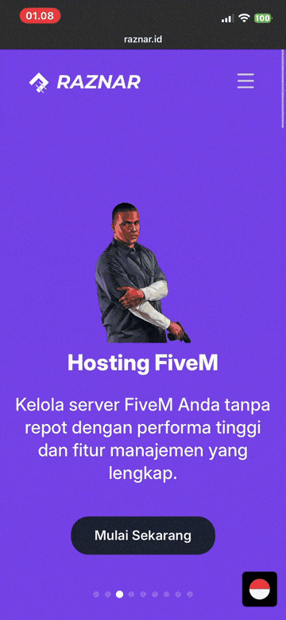

<div align="center">

# Clone With Claude

**Point it at any website. Get back a real, working Next.js codebase.**

A Claude Code skill that reverse-engineers websites into pixel-accurate, independent Next.js projects — no scraping scripts, no manual measuring, just a URL and a `/clone-website` command.


</div>

---

## Contents

- [What this is](#what-this-is)
- [Live example: raznar.id](#live-example-raznarid)
- [How it works](#how-it-works)
- [Supporting tools](#supporting-tools-claudetoolingscripts)
- [Usage](#usage)
- [Recommended setup](#recommended-setup)
- [Managing token usage](#managing-token-usage)
- [Author](#author)

---

## What This Is

This repo is a **multi-clone workspace**, not a single project. Every time you run `/clone-website <url>`, it scaffolds a brand-new, fully independent Next.js + shadcn/ui + Tailwind v4 project in its own folder — named after the target site's hostname — and then rebuilds the site section by section, extracting exact CSS, real content, and real behavior along the way instead of guessing.

It started as a fork of [ai-website-cloner-template](https://github.com/JCodesMore/ai-website-cloner-template), reworked so that multiple clones can live side by side in one repo without ever colliding, backed by a small set of deterministic scripts instead of ad-hoc, hand-edited config.

---

## Live Example: raznar.id

Ran once, end to end, from a single `/clone-website https://raznar.id` command — no manual intervention.

The source turned out to be a static Astro + Tailwind landing page, which let the skill extract the exact HTML/CSS/JS from the page itself — every Tailwind class, keyframe, and behavior in the clone is verbatim from the original, not estimated.

<div align="center">

| Original | Clone |
|:---:|:---:|
|  |  |

</div>

**What got built:**

| Component | Notes |
|---|---|
| Header | Scroll-triggered background swap at 50px; mobile menu with exclusive accordions + body scroll lock |
| Hero | Swiper fade carousel, 9 slides, 5s autoplay, bobbing image animation |
| Products | 21 icon cards with mouse-follow border glow |
| Features | 3 cards, same mouse-follow glow |
| Testimonials | Swiper 1 / 2 / 3-up responsive carousel |
| Clients | 40s CSS infinite marquee, 21 logos |
| Footer | Payment icons, socials, 4-column layout |

**Extraction quality:**
- 68 assets downloaded, **0 failures**
- No external video embeds to work around
- Behaviors reproduced exactly — AOS scroll reveals (1s, ease-in-out-quart, once), rotating conic-gradient card borders on hover, Swiper pagination bullet styling. See [`raznar-id/docs/research/BEHAVIORS.md`](raznar-id/docs/research/BEHAVIORS.md)

**Visual QA — measured, not eyeballed.** Every section was pixel-diffed against the live site at 1440px with [`visual-diff.mjs`](.claude/tooling/scripts/visual-diff.mjs):

| Section | Mismatch |
|---|---:|
| Hero | 0.72% |
| Products | 0.61% |
| Features | 2.38% |
| Footer | 1.78% |

Full artifacts — screenshots, diff images, and every extracted spec — are in [`raznar-id/docs/design-references/`](raznar-id/docs/design-references/) and [`raznar-id/docs/research/`](raznar-id/docs/research/).

---

## How It Works

```
.claude/
  skills/clone-website/       # the skill that does the cloning
  templates/nextjs-base/      # scaffold copied into every new clone
  tooling/scripts/            # supporting Node scripts (see below)
  launch.json                 # one dev-server entry per cloned site, auto-managed
docs/
  CLONE_LOG.md                # ledger of every clone ever run in this repo
<hostname-a>/                 # e.g. raznar-id/ — a full independent Next.js project
<hostname-b>/                 # another clone, fully isolated from the first
```

Nothing is shared between clones except this workspace and the reusable base template — clone ten sites in one repo and none of them will ever touch each other's files, ports, or dev servers.

## Supporting Tools (`.claude/tooling/scripts/`)

Claude Code's built-in tools don't cover a few mechanical, error-prone steps. These close that gap so the skill never hand-edits config files or reimplements the same logic from scratch on every run:

| Script | Purpose |
|---|---|
| `new-site.mjs` | Scaffolds a site from the template, runs `npm install` + `npm run build`, picks a dev-server port by actually binding a socket (not guessing `3000 + N`), and registers it in `.claude/launch.json` + `docs/CLONE_LOG.md`. `--complete <hostname>` flips a clone's ledger status when QA passes. |
| `visual-diff.mjs` | Pixel-diffs a clone screenshot against the original (`sharp` + `pixelmatch`), producing a mismatch percentage and diff image instead of relying on the model eyeballing two screenshots. |
| `download-assets.mjs` *(baked into every site's own `scripts/`)* | Downloads a manifest of assets with retry + `Referer`-header fallback for hotlink-protected CDNs, logging permanent failures to `docs/research/ASSET_FAILURES.md` instead of dropping them silently. |

---

## Usage

1. **Prerequisites:** Node.js ≥24, Claude Code Desktop with Chrome browser tooling (`claude-in-chrome`) connected.
2. Open this repo in Claude Code Desktop.
3. Run:
   ```
   /clone-website <url1> [<url2> ...]
   ```
4. Each URL gets its own folder, its own `npm install`, its own dev-server port — watch it build live in the Claude Code preview panel as sections merge in.
5. To revisit a previously cloned site: `npm --prefix <hostname> run dev`, or use its entry already registered in `.claude/launch.json`.

Check `docs/CLONE_LOG.md` for a running list of every site cloned in this workspace.

---

## Recommended Setup

This skill was built and tuned specifically for **Claude Code Desktop**. It leans heavily on the Chrome browser tool and the live preview panel — both are Desktop-app features, so results elsewhere (terminal-only Claude Code, other IDEs) aren't guaranteed to match.

**Model:** best results at reasonable cost came from **Fable 5 at low reasoning effort**, or **Opus 4.8 at medium/high effort** for more careful extraction on visually complex sites. Sonnet-tier models work but tend to skip extraction detail on complex interactive sections — expect a rougher clone.

## Managing Token Usage

The skill's default behavior — dispatching a parallel builder `Agent` per component, each in its own git worktree — is what makes multi-section clones fast, but it's also the fastest way to burn through tokens, since every dispatched agent is a fresh context that re-reads its spec and redoes its own reasoning. A handful of sections can spawn a dozen-plus agent calls.

If you're on a limited plan or quota, cut this down explicitly before it starts building:

- **"Don't dispatch subagents — build every component yourself, sequentially."** The single biggest lever. Slower (no parallelism), but a fraction of the tokens since there's no per-agent context re-read.
- **Clone one section at a time** instead of letting it plan the whole page upfront — ask it to stop after the foundation + one component and review before continuing.
- **Skip the interaction/behavior sweep depth** for simple static sites — if you already know the site has no scroll-driven or stateful behavior, say so upfront instead of letting it run the full mandatory sweep.
- **Prefer smaller, simpler target sites** while learning the skill's behavior — a single static landing page (like the raznar.id example above) costs far less than a multi-page app with heavy client-side state.

None of this changes what gets extracted or how faithfully it's rebuilt — it only changes whether the work happens in one continuous context or is fanned out across many short-lived agents.

---

## Author

Built and maintained by **[wsprfme](https://github.com/wsprfme)**, using Claude Code as the implementation engine for the skill, tooling, and extraction pipeline described above.
